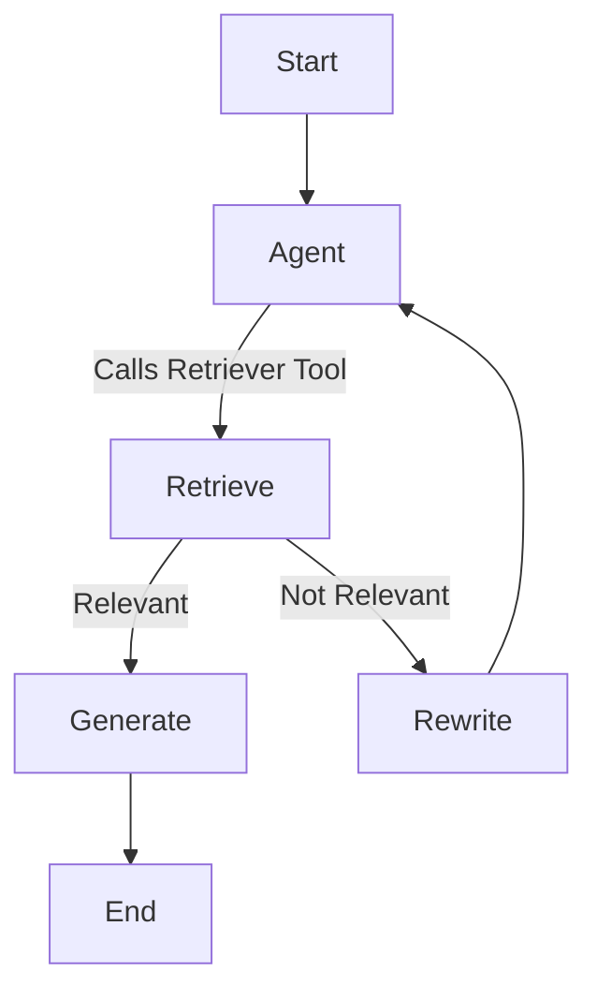

# 🧠 AgenticRAG: Intelligent Information Retrieval with LangChain, LangGraph, and LLMs

This project implements an **Agentic Retrieval-Augmented Generation (AgenticRAG)** system using LangChain, LangGraph, ChromaDB, and OpenAI’s large language models (LLMs). The system dynamically retrieves, evaluates, and answers user questions using real-time autonomous agent workflows — making it ideal for building intelligent assistants, knowledge bots, and contextual Q&A systems.

---

## 🚀 Key Features

- 🔍 **Web-Based Document Retrieval** from URLs using LangChain’s `WebBaseLoader`
- 📚 **Text Chunking & Semantic Search** with `RecursiveCharacterTextSplitter` and Chroma vector store
- ✅ **Relevance Grading** of retrieved content using OpenAI LLMs and structured outputs
- 🔄 **Query Rewriting** for vague/underspecified questions
- 🧠 **Answer Generation** using a custom RAG prompt powered by GPT-3.5/4
- ⚙️ **Agentic Workflow** orchestration using LangGraph’s `StateGraph` for multi-step reasoning

---

## 🛠️ Tech Stack

- Python
- [LangChain](https://www.langchain.com/)
- [LangGraph](https://github.com/langchain-ai/langgraph)
- [OpenAI API](https://platform.openai.com/)
- [Chroma Vector Store](https://www.trychroma.com/)
- Google Colab (for deployment/testing)

---

The workflow is orchestrated as a stateful agent graph:

---

## 📚 Example Use Case

**User Input:**
What are the 5 pointers to make a human live a happy life?

**System Output:**
The 5 pointers to make a human live a happy life are practicing gratitude, spending time with friends and family, getting outside in nature, helping others, and practicing smiling. These activities can increase happiness and life satisfaction. Meditation and planning a trip can also contribute to rewiring the brain for happiness.

## 🧭 Workflow Overview
